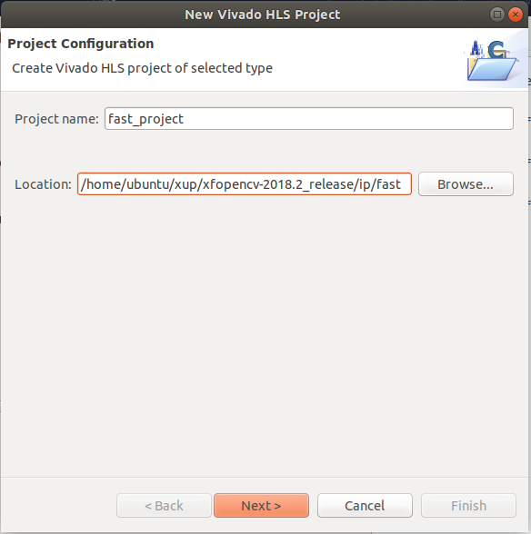

# xfOpenCV Vivado HLS 2018.2 使用指南

**Tips：**
1. xfopencv-2018.2_release.zip为xfOpenCV库文件
2. ip.zip为fast和resize ip的源文件
3. xfopencv-2018.2_example.zip为生成后的工程文件

**WARNING：** xfOpenCV在Windows版Vivado HLS 2018.2中使用会有问题，所以建议使用Ubuntu环境下开发使用。详细信息参见：[Csim error undefined reference to cv::imread and cv::imrite](https://forums.xilinx.com/t5/Vivado-High-Level-Synthesis-HLS/Csim-error-undefined-reference-to-cv-imread-and-cv-imrite/td-p/901813)

## Lab1

Step 0. 
1. 需要提前在Linux下安装Vivado，输入一下命令安装需要的依赖包
```
sudo apt-get install libjpeg62-dev
sudo apt install ocl-icd-opencl-dev
```

2. 解决C Sim出现so库文件找不到、undefined reference等情况，需在{path/to/vivado}/Vivado/2018.2/settings64.sh文件中修改LD_LIBRARY_PATH。
测试环境的路径修改如下，该路径随环境不同有所区别。
```
export LD_LIBRARY_PATH=/snap/gnome-3-26-1604/74/lib/x86_64-linux-gnu/:$LD_LIBRARY_PATH
```

Step 1. 使用提供的xfOpenCV包(xfopencv-2018.2_release.zip)或者自己从github上下载2018.2版本[xfOpenCV](https://github.com/Xilinx/xfopencv/releases)包


Step 2. 将xfOpenCV拷贝至Linux并解压。

Step 3. 打开终端，输入以下命令，打开Vivado HLS
```
source {path/to/vivado}/Vivado/2018.2/settings64.sh
vivado_hls
```

**Tips：** {path/to/vivado}为你Vivado安装路径。

Step 4. 修改当前目录，执行脚本，生成工程
```
cd {path/to/xfopencv}/xfopencv-2018.2_release/HLS_Use_Model/AXI_Sample
vivado_hls ./script.tcl
```
**Tips：** {path/to/xfopencv}为你xfopencv-2018.2_release解压路径。

Step 5. 当输出如下信息时，案例工程生成完成
```
INFO: [HLS 200-112] Total elapsed time: 512.29 seconds; peak allocated memory: 223.328 MB.
INFO: [Common 17-206] Exiting vivado_hls 
```

Step 6. 打开Vivado HLS，导入工程
```
vivdo_hls
```
选择 Open Project-->{path/to/}HLS_Use_Model/AXI_Sample/dilation_project-->OK 打开工程

Step 7. 选择 Solution-->Export RTL-->OK，导出ip，此时会出现{path/to/xfopencv}/xfopencv-2018.2_release/HLS_Use_Model/AXI_Sample/dilation_project/solution1/impl/ip文件夹。

将该文件夹或文件夹内xilinx_com_hls_ip_accel_app_1_0.zip拷贝至cam_in_hdmi_out工程下的ip文件夹内解压，替换掉cam_in_hdmi_out内fast ip，修改sdk程序，即可使用该ip。

## Lab2
Lab1为通过命令行生成xfOpenCV例程，接下来介绍图形化界面创建Vivado HLS工程。

Step 1. 将ip.zip拷贝至Linux下xfOpenCV路径并解压，输出信息应如下所示
```
$ ls {path/to/xfOpencv}
CONTRIBUTING.md  HLS_Use_Model  ip      library.json  README.md
examples         include        ip.zip  LICENSE.txt
```

Step 2. 打开终端，输入以下命令，打开Vivado HLS
```
source {path/to/vivado}/Vivado/2018.2/settings64.sh
vivado_hls
```
Step 3. 单击Create New Project，Project name填写fast_project，Browse...选择{path/to/xfopencv}/xfopencv-2018.2_release/ip/fast，单击Next。


Step 4. Top function填写fast_ip，单击Add Files,添加xf_fast_accel.cpp，xf_ip_accel_app.cpp。单击Edit CFLAG,填入
```
-I../../include -I../../include/src -D__XFCV_HLS_MODE__ --std=c++0x 
```
分别对两个文件添加CFLAG，并单击Next。


Step 5. 单击Add Files,添加paris.jpg，xf_fast_tb.cpp。单击xf_fast_tb.cpp的Edit CFLAG,填入
```
-I../../include -I../../include/src -D__XFCV_HLS_MODE__ --std=c++0x 
```
对xf_fast_tb.cpp添加CFLAG，并单击Next。


Step 6. 修改Part为xc7z020clg400-1，单击Finish。


Step 7. 选择Project-->Run C Simulation，在弹出窗口，勾选Clean Build，在Input Arguments中输入paris.jpg，


单击OK，仿真完成后，会出现如下信息。
```
INFO: [SIM 2] *************** CSIM start ***************
INFO: [SIM 4] CSIM will launch GCC as the compiler.
   Compiling ../../../../xf_fast_tb.cpp in debug mode
   Compiling ../../../../xf_fast_accel.cpp in debug mode
   Compiling ../../../../xf_ip_accel_app.cpp in debug mode
   Generating csim.exe
ocvpoints:7977=
Commmon = 7977	 Success = 100.000000	 Loss = 0.000000	 Gain = 0.000000
INFO: [SIM 1] CSim done with 0 errors.
INFO: [SIM 3] *************** CSIM finish ***************
```

Step 8. 此时，{path/to/xfopencv}/xfopencv-2018.2_release/ip/fast/fast_prj/solution1/csim/build下会出现hls_out.jpg


Step 9. 之后按照HLS的流程，Run C Synthesis，Export RTL即可。